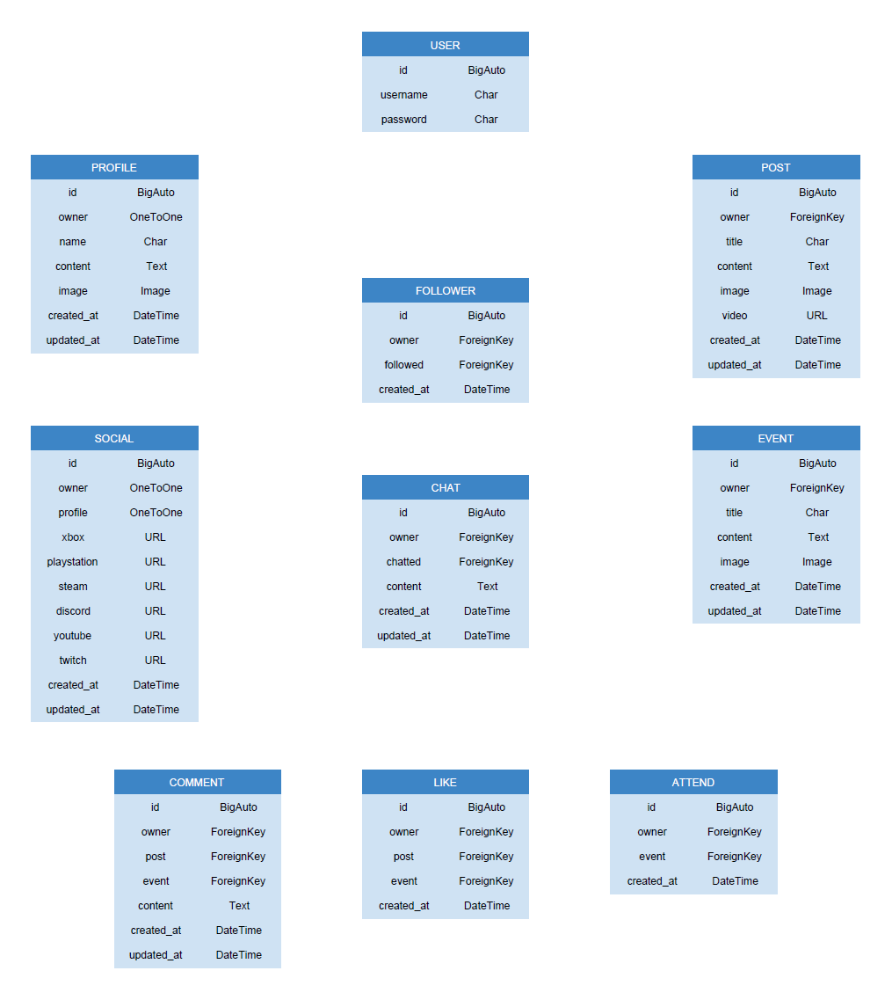

<h1 align="center">Gamer Guild API</h1>

The Gamer Guild API was created to serve the [Gamer Guild](https://github.com/AlexaH88/gamer-guild) React app. The API includes the following apps, allowing for a rich database and a versatile front-end application:
- profiles
- socials
- followers
- chats
- posts
- events
- responses
- comments
- likes
- attends

## __User Experience (UX)__

-   ### ***User stories***

    <!-- -   #### First Time Visitor Goals

        1. As a First Tiem Visitor I can use a search bar on the homepage so that I can easily find the song I'm looking for.

    -   #### Returning Visitor Goals

        1. As a Returning Visitor I can sign up for an account so that I can create, edit and delete lyrics.
        2. As a Returning Visitor I can login to an account so that I can access my songs as a returning user.
        3. As a Returning Visitor I can logout of an account so that I remove access to anyone else using the computer

    -   #### Frequent User Goals

        1. As a Frequent User (Site User / Site Admin) I can create song lyrics so that other users can find the lyrics to their favourite songs.
        2. As a Frequent User (Site User / Site Admin) I can edit song lyrics that I've created so that I can modify the content if needed.
        3. As a Frequent User (Site User / Site Admin) I can delete song lyrics that I've created so that I can remove my contribution if needed. -->

-   ### ***Entity Relationship Diagram***

    - The following Entity Relationship Diagram was created to show the models used. The in-built Django User model was used for this project, and the following custom models were created:
        - Profile
        - Social
        - Follower
        - Chat
        - Post
        - Event
        - Response
        - Comment
        - Like
        - Attend

    -   Entity Relationship Diagram:
        

## __Technologies Used__

### ***Languages Used***

-   [Python](https://en.wikipedia.org/wiki/Python_(programming_language))

### ***Frameworks, Libraries & Programs Used***

1. [Django Rest Framework:](https://www.django-rest-framework.org/)
    - The Django web framework was used to create the web API.

1. [PostgreSQL:](https://en.wikipedia.org/wiki/PostgreSQL)
    - PostgreSQL was used as the object-relational database system.

1. [ElephantSQL:](https://www.elephantsql.com/)
    - ElephantSQL was used to host the database.

1. [Git:](https://git-scm.com/)
    - Git was used for version control by utilizing the Gitpod terminal to commit to Git and Push to GitHub.

1. [GitHub:](https://github.com/)
    - GitHub is used to store the projects code after being pushed from Git.

1. [Heroku:](https://heroku.com/)
    - Heroku was used for the deployed application.

## __Testing__

### ***Python Testing***

<!-- -   [CI Python Linter](https://pep8ci.herokuapp.com/) was used to validate the Python code in this project. All code passed without errors, except `settings.py` and `env.py` which showed E501 'line too long' warnings.
    
    
     -->

### ***Manual Testing***

<!-- - Manual testing was performed app-wide to ensure a smooth and positive user experience. 

- Consistent testing was carried out to ensure there was a logical flow when using the app, and that user's expectations for where links would take them, and what would follow user actions were respected.

- Alert messages are displayed when a user has completed an action, to explain why they are not seeing any data, or if input is incorrect or required:
  
  
  
  
  
  
  
  
  
  
   -->

[//]: <> (Deployment section taken from Dave Horrocks, and credited in the Content section of the Credits)

## Deployment

### Heroku

1. Navigate to your [Heroku dashboard](https://dashboard.heroku.com/apps)
2. Click "New" and select "Create new app".  
  
3. Input a meaningful name for your app and choose the region best suited to
  your location.  
  
4. Select "Settings" from the tabs.  
  
5. Click "Reveal Config Vars".  
 
6. Input all key-value pairs as necessary from the `.env` file. **Ensure DEBUG
   and DEVELOPMENT are not included**.
   
7. Click "Add buildpack".  
 
8. Add "python" from the list or search if necessary, remember to
 click save.  
 
9. Select "Deploy" from the tabs.  

10. Select "GitHub - Connect to GitHub" from deployment methods.  
 
11. Click "Connect to GitHub" in the created section.  
 
12. Search for the GitHub repository by name.  
13. Click to connect to the relevant repo.
14. Either click `Enable Automatic Deploys` for automatic deploys or `Deploy
 Branch` to deploy manually. Manually deployed branches will need
 re-deploying each time the repo is updated.  
 
15. Click `View` to view the deployed site.  
    
16. The live site can also be accessed from your repo in GitHub from the
    environments section of the repo.

The site is now live and operational

## __Credits__

### ***Code***

<!-- - The following were used as references to help with writing the HTML, CSS, JavaScript and Python code:
  - [Code Institute LMS](https://learn.codeinstitute.net/ci_program/diplomainsoftwaredevelopmentecommerce), in particular the [CI I Think Therefore I Blog Walkthrough](https://learn.codeinstitute.net/courses/course-v1:CodeInstitute+FST101+2021_T1/courseware/b31493372e764469823578613d11036b/fe4299adcd6743328183aab4e7ec5d13/)
  - [W3Schools](https://www.w3schools.com/) 
  - [Stack Overflow](https://stackoverflow.com/)
  - [MDN Web Docs](https://developer.mozilla.org/en-US/)
  - [Django Documentation](https://docs.djangoproject.com/en/4.1/)

- The hero image full background cover was taken from [Nicolas Lule](https://nicolaslule.com/responsive-full-width-hero-image-using-flex/) and adapted.

- The Search Bar functionality was taken from [Codemy](https://www.youtube.com/watch?v=AGtae4L5BbI) and adapted. 

- The alert messages close buttons were taken from [W3Schools](https://www.w3schools.com/howto/howto_js_alert.asp) and adapted.

- The jukebox animation on the Song Lyrics page was taken from and inspired by [CSS Tricks](https://css-tricks.com/css-only-infinite-and-circular-image-slider/) and adapted.

- The code for the scroll effect on the lyrics on the Song Lyrics page and the songs throughout the app when there is a lot of data was taken from [W3Schools](https://www.w3schools.com/cssref/pr_scroll-behavior.php) and adapted. 

- The Delete Song form view and templates were taken from [OpenClassrooms](https://openclassrooms.com/fr/courses/6967196-create-a-web-application-with-django/7349788-delete-objects-safely-with-user-confirmation) and adapted.

- The slug being automatically created from the song title was taken from [AppsLoveWorld](https://www.appsloveworld.com/django/100/279/pre-populate-slug-field-into-a-form-field-of-a-django-site) and adapted.

- The input fields when adding or editing a song automatically being capitalised were taken from [LearnPython](https://learnpython.com/blog/uppercase-letter-python/) and [Google Groups](https://groups.google.com/g/django-users/c/gbU-pfCgCL8?pli=1) respectively and adapted.

- The favicon code was taken from [W3Schools](https://www.w3schools.com/), specifically from [HTML Favicon](https://www.w3schools.com/html/html_favicon.asp) and adapted. -->

### ***Content***

- The Deployment section in the README was taken from the masterful [Dave Horrocks](https://github.com/DaveyJH), who put it so much better than I could! 

### ***Acknowledgements***

Massive thanks to: 

- My mentor, [Lauren-Nicole Popich](https://github.com/CluelessBiker), for guiding me and giving me helpful feedback and advice - and for giving me confidence when I didn't believe in myself!

- My fellow Code Institute students and friends for their help, generous feedback, and incredible knowledge:
  
  - [Abi Harrison](https://github.com/Abibubble)
  - [Dave Horrocks](https://github.com/DaveyJH)
  - [Emanuel Silva](https://github.com/manni8436)
  - [Kera Cudmore](https://github.com/kera-cudmore)
  - [Megan Vella](https://github.com/Medusas71)
  - [Monika Hrda](https://github.com/monika-hrda)
  - [Natalie Alexander](https://github.com/natalie-kate)
  - [Sandra Atino](https://github.com/Atinos31)
  - [Suzy Bennett](https://github.com/suzybee1987)

- Tutor Support, Student Care and the Slack Community at [Code Institute](https://codeinstitute.net/global/) for their support.

- And last but not least, my fiancé [Antoine Masson](https://www.linkedin.com/in/antoine-masson-55b65094/) for helping me through the stressful moments and for supporting us financially while I make this big career change. 